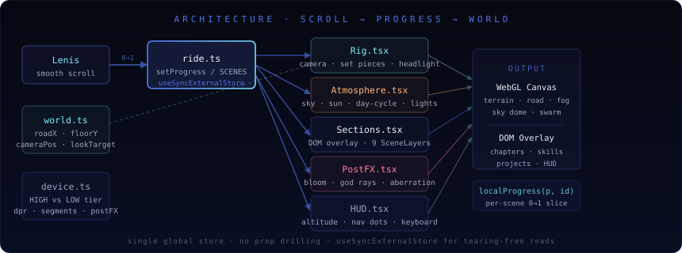
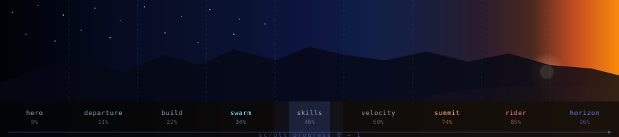
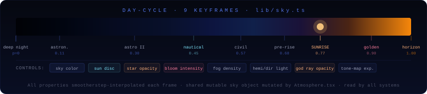

<div align="center">



<br/>

[](https://nextjs.org)
[](https://threejs.org)
[](https://react.dev)
[](https://typescriptlang.org)
[](https://tailwindcss.com)
[](LICENSE)

**A scroll-driven 3D portfolio.  
Ride a computed Karakoram mountain pass from deep night to golden sunrise.**

[**Live Demo →**](https://hassannazir.dev) &nbsp;&nbsp;·&nbsp;&nbsp; [GitHub](https://github.com/zimkk/portfolio-webGL)

</div>

---

## What is this?

A portfolio that is also a ride. As you scroll, a procedural mountain road unfolds in WebGL — switchback curves, a full day-cycle from deep night to sunrise, analytic terrain, and a parked Honda Shadow at the overlook. The 3D world and DOM overlays are driven by a single shared progress value so nothing ever drifts out of sync.

---

## Architecture

### Scroll → Progress → World



One global store (`lib/ride.ts`) maps Lenis scroll position to a `progress` value between 0 and 1. Every consumer — the 3D camera, the DOM chapter cards, the day-cycle, the post-processing pipeline, the HUD — reads from this same value via `useSyncExternalStore`. No prop drilling, no drift, no double rendering.

```
Lenis scroll  →  setProgress(p)  →  ride.progress (0 → 1)
                                      ├── Rig.tsx        camera · set pieces · headlight
                                      ├── Atmosphere     day-cycle · sky dome · lights
                                      ├── Sections       DOM overlay · 9 SceneLayers
                                      ├── PostFX         bloom · god rays · aberration
                                      └── HUD            altitude · nav dots · keyboard
```

`localProgress(globalP, id)` slices the global 0→1 into a per-scene 0→1 value so each `SceneLayer` fades in/out independently.

---

### Scene Journey



| # | Scene | Progress | Sky | Camera set piece |
|---|-------|----------|-----|-----------------|
| 1 | **hero** | 0 % | Deep night · stars · Milky Way | Aerial reveal, descend to road |
| 2 | **departure** | 11 % | Astronomical dawn | Road follow, slight bank |
| 3 | **build** | 22 % | Astronomical dawn II | Road follow |
| 4 | **swarm** | 34 % | Nautical twilight | Liftoff · flock anchor |
| 5 | **skills** | 46 % | Civil twilight | Road follow |
| 6 | **velocity** | 60 % | Pre-sunrise indigo | Tarmac hug · camera shake |
| 7 | **summit** | 74 % | **SUNRISE** | Crest rise, sun crests horizon |
| 8 | **rider** | 85 % | Golden morning | Pan to parked Honda Shadow |
| 9 | **horizon** | 96 % | Full golden light | Sky ascent |

---

### Day-Cycle



`lib/sky.ts` defines 9 keyframes at specific progress values. Each frame carries sky colour, star opacity, sun disc brightness, fog density, hemisphere/directional light colour and intensity, tone-mapping exposure, and bloom/god-ray strength. Every property smootherstep-interpolates toward the target value each frame. The shared mutable `sky` object is mutated by `Atmosphere.tsx` and read by every other system — no rerenders, no subscriptions, just a direct float each frame.

---

## Features

### 3D World
- **Analytic terrain** — `roadX(z)` switchbacks + `floorY(z)` altitude climb + `terrainHeight(x,z)` displaced mesh. All pure functions shared by terrain, camera, and props.
- **Day-cycle** — 9 keyframes, deep night → astronomical dawn → nautical twilight → civil → pre-sunrise → **SUNRISE** → golden morning. Stars, Milky Way, cirrus, volumetric sun disc, god rays.
- **Road** — asphalt ribbon with lane markings, cat's-eyes, and guard posts. Follows `roadX(z)` exactly.
- **Fog** — multi-layer screen-space fog planes, colour-matched to the sky phase.
- **Roadside** — lattice pylons, Gridcore billboard, **Honda Shadow RS 2010 GLTF** with warm key + cool rim + tail-glow lighting.
- **Valley life** — village lights, prayer-flag pennants, speed streaks, dawn light motes.

### Camera Choreography (`three/Rig.tsx`)
- **Hero** — aerial liftoff, slow descend to road level
- **Swarm** — drone liftoff, camera lifts with the flock
- **Velocity** — tarmac hug + camera shake + speed FOV push
- **Summit** — camera crests the ridge as the sun breaks the horizon
- **Rider** — pans right to reveal the parked bike at the overlook
- **Horizon** — sky ascent into full dawn

### Agent Swarm (`three/Swarm.tsx`)
- **8 drones** — Tommy (lead) + 7 sub-agents with spring-flocking physics
- Delegation links, animated data packets, per-agent labels
- Anchored at `SWARM_ANCHOR` (progress 0.34, left side of road)

### Post-Processing (`three/PostFX.tsx`)
- Bloom (intensity driven by `sky.sunDisc`)
- God rays (on the sun mesh, opacity driven by `sky.godRayOpacity`)
- Chromatic aberration (driven by velocity scene)
- Vignette + film grain

### DOM Overlay (`Sections.tsx`)
- 9 `SceneLayer` components, each opacity-driven by `localProgress`
- Chapter cards, skill seg-meters, velocity flash markers, project constellation, contact

### UI / UX
- **Music player** — jingle-truck SVG icon, Bollywood playlist, track progress, volume slider, EQ animation
- **Custom cursor** — lagged ring with magnetic button support
- **Keyboard nav** — `↑` / `↓` / `PageUp` / `PageDown` jump between scenes
- **HUD** — altitude readout (0 → 5 000 m), scene nav dots
- **Preloader** — count-up 00→100, slides away on ready
- **Accessibility** — skip link, `prefers-reduced-motion`, ARIA labels, focus styles, WCAG AA contrast

### Performance
- **Device tier detection** — HIGH (post-FX, 200-segment terrain, dpr `[1, 2]`) vs LOW (no post-FX, 110 segments, dpr `[1, 1.4]`) based on `navigator.deviceMemory`, CPU cores, and screen size
- Next.js Turbopack, `useGLTF.preload`, canvas fixed behind scroll so layout never reflows

---

## Quick Start

```bash
git clone https://github.com/zimkk/portfolio-webGL
cd portfolio-webGL
npm install
npm run dev
```

Open [http://localhost:3000](http://localhost:3000). Scroll to ride.

---

## Making It Yours

### 1. Edit content

Everything visible on screen lives in **[`src/lib/content.ts`](src/lib/content.ts)**:

```ts
export const IDENTITY = {
  name:     "Your Name",
  role:     "Your Title",
  email:    "you@example.com",
  github:   "https://github.com/you",
  linkedin: "https://linkedin.com/in/you",
  tagline:  "Short punchy tagline.",
};

export const CHAPTERS = [/* 3 career chapters */];
export const PROJECTS  = [/* up to 6 projects  */];
export const SKILLS    = [/* skill groups       */];
export const IMPACT    = [/* 6 impact numbers   */];
export const DRONES    = [/* lead + 7 sub-agents */];
```

### 2. Set your domain

```bash
cp .env.example .env.local
```

```env
NEXT_PUBLIC_SITE_URL=https://yourdomain.com
```

Drives sitemap, robots.txt, OG image, and canonical links.

### 3. Add music

The player expects MP3s in `public/audio/` (gitignored — supply your own).  
Edit `PLAYLIST` in [`src/components/ui/SoundToggle.tsx`](src/components/ui/SoundToggle.tsx):

```ts
{ id: "01", title: "Track", artist: "Artist", src: "/audio/track.mp3", duration: "4:30" }
```

### 4. Add a scene

1. Add an entry to `RAW` in [`src/lib/ride.ts`](src/lib/ride.ts) with a `weight`
2. Add the `SceneId` type literal
3. Add `<SceneLayer id="..." label="...">` in [`src/components/Sections.tsx`](src/components/Sections.tsx)
4. Add content to `src/lib/content.ts`
5. Add a sky keyframe in [`src/lib/sky.ts`](src/lib/sky.ts) at the right `p`
6. *(Optional)* Add a camera set piece in [`src/components/three/Rig.tsx`](src/components/three/Rig.tsx)

---

## File Map

```
src/
├── app/
│   ├── layout.tsx              metadata · fonts · JSON-LD schema
│   ├── page.tsx                renders <Ridgeline />
│   ├── globals.css             design tokens · Tailwind · utility classes
│   ├── opengraph-image.tsx     dynamic OG card (1200×630)
│   ├── sitemap.ts              auto sitemap.xml
│   └── robots.ts               robots.txt
│
├── components/
│   ├── Ridgeline.tsx           root shell · preloader · 3D · scroll · HUD
│   ├── Sections.tsx            9 DOM scene layers (opacity-driven)
│   ├── SmoothScroll.tsx        Lenis wrapper
│   │
│   ├── three/
│   │   ├── Experience.tsx      R3F Canvas
│   │   ├── Atmosphere.tsx      sky dome shader · sun disc · lights
│   │   ├── Terrain.tsx         displaced mesh · analytic surface
│   │   ├── Road.tsx            asphalt ribbon · markings · guard posts
│   │   ├── FogPlanes.tsx       screen-space fog sheets
│   │   ├── Roadside.tsx        pylons · sign · Honda Shadow GLTF
│   │   ├── WorldLife.tsx       valley lights · pennants · dawn motes
│   │   ├── Swarm.tsx           8-drone agent flock
│   │   ├── Rig.tsx             camera choreography · headlight
│   │   └── PostFX.tsx          bloom · god rays · aberration · grain
│   │
│   └── ui/
│       ├── Preloader.tsx       00→100 count-up
│       ├── HUD.tsx             altitude · nav dots · keyboard nav
│       ├── SoundToggle.tsx     jingle-truck music player
│       ├── Cursor.tsx          lagged ring cursor
│       ├── ChapterCard.tsx     editorial chapter overlay
│       └── ...                 Decode, Reveal, CountUp, MagneticButton
│
└── lib/
    ├── content.ts              single source of truth for all copy
    ├── ride.ts                 global scroll state · scene definitions · math
    ├── sky.ts                  9-keyframe day-cycle
    ├── world.ts                terrain model — pure analytic functions
    └── device.ts               HIGH vs LOW tier detection
```

---

## Design Tokens

All colours are CSS custom properties used throughout the codebase and the SVG diagrams above:

| Token | Value | Role |
|-------|-------|------|
| `--void` | `#05060a` | Page background |
| `--text` | `#edeff5` | Primary text |
| `--muted` | `#9aa0b8` | Secondary text (WCAG AA) |
| `--blue` | `#5b7fff` | Primary accent |
| `--cyan` | `#7fe9ff` | Secondary accent |
| `--amber` | `#ffb27a` | Sunrise / warm |
| `--rose` | `#ff7e9d` | Tail-light / rider |

---

## Attribution

- **Honda Shadow RS 2010** by [Alex.Ka.](https://sketchfab.com/Alex.Ka.) — [CC BY-NC-ND 4.0](https://creativecommons.org/licenses/by-nc-nd/4.0/). Not for commercial use; no derivatives. Explicitly excluded from the MIT grant — see [LICENSE](LICENSE).
- **Audio tracks** — not included in this repository. Supply your own MP3s in `public/audio/`.

---

## License

MIT — see [LICENSE](LICENSE).

The Honda Shadow model in `public/models/` is CC BY-NC-ND 4.0 and is explicitly excluded from the MIT grant.
